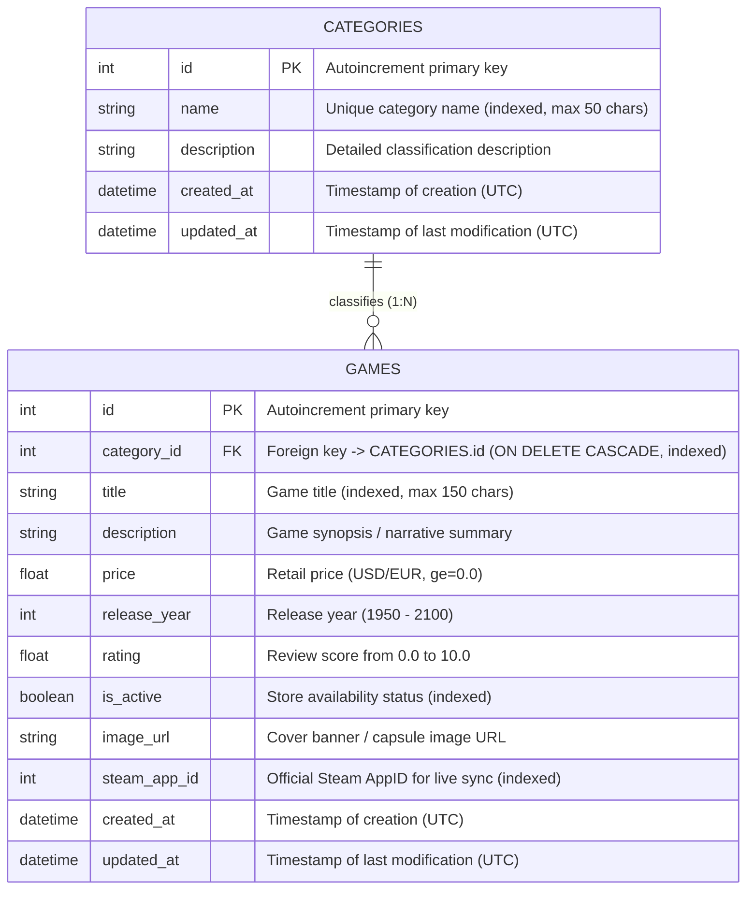
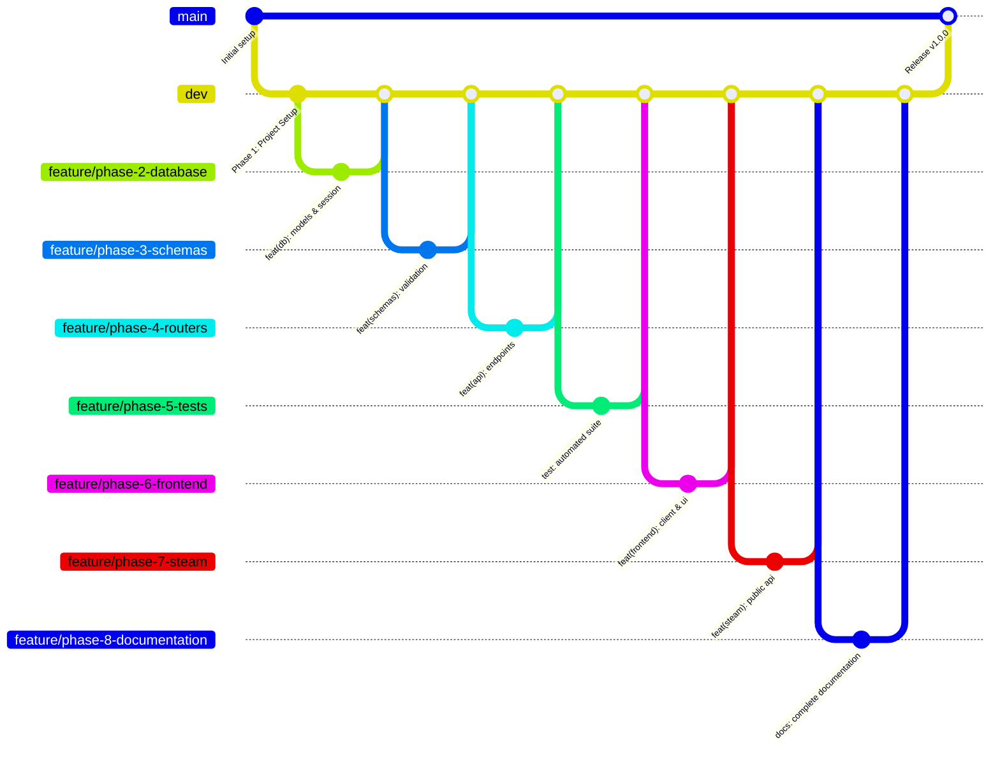

# VaporStore REST API & Client Portal


A production-grade, relational RESTful API developed with **FastAPI**, **SQLAlchemy 2.0 (Declarative)**, **Pydantic v2**, and **SQLite/PostgreSQL**, accompanied by a responsive client web application written in **HTML5, CSS3, Vanilla JavaScript, and Axios**.

Designed for **TechSolutions** digital ecosystem, **VaporStore** provides a robust, scalable backend for managing video game catalogs and their classification hierarchies, enriched with official public **Steam Web API** integration for real-time live data and 1-click importing.

---

## Table of Contents

1. [Architectural Overview](#architectural-overview)
2. [Relational Data Model (DER)](#relational-data-model-der)
3. [Project Directory Layout](#project-directory-layout)
4. [Getting Started & Local Installation](#getting-started--local-installation)
5. [Environment Configuration](#environment-configuration)
6. [API Endpoints Catalog](#api-endpoints-catalog)
7. [Steam API Integration (The Cherry on Top)](#steam-api-integration-the-cherry-on-top)
8. [Automated Testing Suite](#automated-testing-suite)
9. [Git Branching Strategy](#git-branching-strategy)
10. [Evaluation Rubric Compliance Matrix](#evaluation-rubric-compliance-matrix)
11. [Oral Presentation Guide (10–15 min)](#oral-presentation-guide-1015-min)

---

## Architectural Overview

The backend architecture strictly complies with clean architecture separation of concerns, PEP 8 standards, and asynchronous non-blocking patterns:

- **Framework**: **FastAPI** leveraging Starlette and AnyIO for high-throughput asynchronous execution.
- **ORM & Database Engine**: **SQLAlchemy 2.0+** using declarative base mappings (`Mapped`, `mapped_column`) with explicit relational constraints, foreign keys, and indexes.
- **Relational Integrity**: 1:N relationship connecting `Category` and `Game` models with `ON DELETE CASCADE` ensuring complete referential integrity.
- **Data Validation & Serialization**: **Pydantic v2** schemas with `from_attributes = True` separating input payloads (`Create`, `Update`) from response envelopes.
- **HTTP Semantics & Error Handling**: Semantic status codes (`200 OK`, `201 Created`, `204 No Content`, `400 Bad Request`, `404 Not Found`, `422 Unprocessable Entity`, `502 Bad Gateway`) with rollback handling upon database exceptions.
- **Frontend Client**: Mobile-first responsive client interface with dark gaming aesthetics, native accessible `<dialog>` modals, search debounce, dynamic filters, pagination, and an interactive browser-based API testing portal.
- **Language Invariant**: 100% of the codebase, docstrings, unit tests, commit messages, and documentation are written strictly in **English**.

---

## Relational Data Model (DER)



### Relational Features
- **Foreign Key**: `games.category_id` references `categories.id` with `ondelete="CASCADE"`.
- **Cascade Delete**: Deleting a category automatically deletes all associated games from the database.
- **Joined Eager Loading**: Relational queries use SQLAlchemy `joinedload` preventing N+1 query performance degradations.
- **Indexes**: Applied to foreign keys (`category_id`), search fields (`title`, `name`), and filtering fields (`is_active`, `steam_app_id`).

---

## Project Directory Layout

```text
python-api-rest/
├── start.bat                          # Automated 1-click Quick Start script for Windows
├── start.sh                           # Automated 1-click Quick Start script for Linux / macOS
├── AGENTS.md                          # Workspace rules, English invariants & branching standards
├── README.md                          # Comprehensive technical documentation & API spec
├── .env.example                       # Template for local environment variables
├── .gitignore                         # Configured rules ignoring .venv, *.db, and test caches
├── requirements.txt                   # Production and testing Python dependencies
│
├── backend/
│   ├── app/
│   │   ├── __init__.py                # Package initializer
│   │   ├── main.py                    # FastAPI application, lifespan, CORS, static mounting
│   │   ├── config/
│   │   │   ├── __init__.py
│   │   │   └── settings.py            # Pydantic BaseSettings loading environment configuration
│   │   ├── database/
│   │   │   ├── __init__.py
│   │   │   ├── base.py                # SQLAlchemy DeclarativeBase
│   │   │   └── session.py             # Engine, SessionLocal factory, and get_db dependency
│   │   ├── models/
│   │   │   ├── __init__.py
│   │   │   ├── category.py            # Category ORM model (1:N relationship with Game)
│   │   │   └── game.py                # Game ORM model (Foreign Key, indexes, steam_app_id)
│   │   ├── schemas/
│   │   │   ├── __init__.py
│   │   │   ├── category.py            # CategoryCreate, CategoryUpdate, CategoryResponse
│   │   │   ├── game.py                # GameCreate, GameUpdate, GameResponse
│   │   │   ├── pagination.py          # Generic envelope PaginatedResponse[T]
│   │   │   └── steam.py               # SteamSearchResponse, SteamStatsResponse
│   │   ├── services/
│   │   │   ├── __init__.py
│   │   │   ├── category_service.py    # Category CRUD, transaction rollbacks, games count
│   │   │   ├── game_service.py        # Game CRUD, filtering, pagination, FK validation
│   │   │   └── steam_service.py       # Asynchronous httpx Steam API client & 1-click import
│   │   └── routes/
│   │       ├── __init__.py            # Mounts /api/v1 router
│   │       ├── categories.py          # Category endpoints (/api/v1/categories)
│   │       ├── games.py               # Game endpoints (/api/v1/games)
│   │       ├── steam.py               # Steam integration (/api/v1/steam, /games/steam)
│   │       └── health.py              # Health check (/api/v1/health)
│   └── tests/
│       ├── __init__.py
│       ├── conftest.py                # Isolated in-memory SQLite fixtures & TestClient
│       ├── test_categories.py         # Category CRUD & validation tests (7 tests)
│       ├── test_games.py              # Game CRUD, filtering, pagination, cascade tests (6 tests)
│       ├── test_frontend.py           # Client UI & static delivery tests (3 tests)
│       └── test_steam.py              # Steam search, import, and player stats tests (7 tests)
│
└── frontend/
    ├── index.html                     # Semantic HTML5 client & interactive API explorer
    ├── css/
    │   └── styles.css                 # Dark gaming responsive stylesheet with CSS variables
    └── js/
        ├── api.js                     # Axios client with auto-discovery & response interceptors
        └── app.js                     # DOM state controller, modals, debounce, and live polling
```

---

## Getting Started & Local Installation

### Prerequisites
- **Python**: Version 3.10 or higher (Python 3.13 recommended).
- **Git**: Version 2.30 or higher.
- A modern web browser (Google Chrome, Mozilla Firefox, Microsoft Edge, or Safari).

### ⚡ Quick Start (1-Click Automated Setup)

You can automatically initialize the virtual environment, install all dependencies, configure `.env`, start the server, and open the web client in your default browser:

- **On Windows**: Double-click `start.bat` or run:
  ```cmd
  start.bat
  ```
- **On Linux / macOS**: Run:
  ```bash
  chmod +x start.sh
  ./start.sh
  ```

---

### Manual Step-by-Step Installation

1. **Clone the repository**:
   ```bash
   git clone https://github.com/DesarrolloWebFullStackIA/python-api-rest.git
   cd python-api-rest
   ```

2. **Create and activate a Python virtual environment**:
   - **On Windows (PowerShell)**:
     ```powershell
     python -m venv .venv
     .\.venv\Scripts\Activate.ps1
     ```
   - **On Linux / macOS**:
     ```bash
     python3 -m venv .venv
     source .venv/bin/activate
     ```

3. **Install dependencies**:
   ```bash
   pip install -r requirements.txt
   ```

4. **Configure environment variables**:
   ```bash
   cp .env.example .env
   ```

5. **Start the FastAPI application**:
   ```bash
   uvicorn app.main:app --app-dir backend --host 127.0.0.1 --port 8000 --reload
   ```

6. **Access the application**:
   - **Web Client UI**: [http://127.0.0.1:8000/client/](http://127.0.0.1:8000/client/)
   - **Interactive OpenAPI Documentation (Swagger UI)**: [http://127.0.0.1:8000/docs](http://127.0.0.1:8000/docs)
   - **Alternative ReDoc Documentation**: [http://127.0.0.1:8000/redoc](http://127.0.0.1:8000/redoc)
   - **Service Health Check**: [http://127.0.0.1:8000/api/v1/health](http://127.0.0.1:8000/api/v1/health)

---

## Environment Configuration

Configuration is managed via Pydantic `BaseSettings` (`backend/app/config/settings.py`) reading from `.env`:

| Variable | Type | Default | Description |
| :--- | :--- | :--- | :--- |
| `APP_NAME` | `str` | `Video Games API` | Name of the service displayed in OpenAPI metadata |
| `APP_VERSION` | `str` | `1.0.0` | Semantic version of the application |
| `APP_DESCRIPTION` | `str` | (Detailed string) | OpenAPI portal description |
| `ENVIRONMENT` | `str` | `development` | Runtime environment (`development`, `testing`, `production`) |
| `DEBUG` | `bool` | `True` | Enable or disable verbose debug outputs |
| `DATABASE_URL` | `str` | `sqlite:///./games.db` | Database connection URI (SQLite or PostgreSQL) |
| `CORS_ORIGINS` | `str` | `*` | Allowed CORS origins (comma-separated list) |

---

## API Endpoints Catalog

All API endpoints are versioned under the `/api/v1` prefix.

### 1. Health & Root

#### `GET /api/v1/health`
Checks API service health and database connectivity.
```bash
curl -X GET "http://127.0.0.1:8000/api/v1/health"
```
**Response (200 OK):**
```json
{
  "status": "healthy",
  "app_name": "Video Games API",
  "version": "1.0.0",
  "database": "connected"
}
```

---

### 2. Categories Management (`/api/v1/categories`)

#### `GET /api/v1/categories/`
Retrieves all categories ordered alphabetically, each annotated with its computed count of associated games.
```bash
curl -X GET "http://127.0.0.1:8000/api/v1/categories/"
```
**Response (200 OK):**
```json
[
  {
    "id": 1,
    "name": "Action",
    "description": "Fast-paced games focusing on combat and reflexes.",
    "created_at": "2026-09-28T10:00:00Z",
    "updated_at": "2026-09-28T10:00:00Z",
    "games_count": 4
  },
  {
    "id": 2,
    "name": "Role-Playing (RPG)",
    "description": "Games emphasizing narrative choices and character progression.",
    "created_at": "2026-09-28T10:00:00Z",
    "updated_at": "2026-09-28T10:00:00Z",
    "games_count": 8
  }
]
```

#### `POST /api/v1/categories/`
Creates a new category. The name must be unique.
```bash
curl -X POST "http://127.0.0.1:8000/api/v1/categories/" \
     -H "Content-Type: application/json" \
     -d '{"name": "Survival Horror", "description": "Tense and atmospheric gameplay."}'
```
**Response (201 Created):**
```json
{
  "id": 6,
  "name": "Survival Horror",
  "description": "Tense and atmospheric gameplay.",
  "created_at": "2026-09-28T12:00:00Z",
  "updated_at": "2026-09-28T12:00:00Z",
  "games_count": 0
}
```

#### `GET /api/v1/categories/{id}`
Retrieves a single category by its identifier. Returns `404 Not Found` if nonexistent.

#### `PUT /api/v1/categories/{id}`
Updates category information.
```bash
curl -X PUT "http://127.0.0.1:8000/api/v1/categories/6" \
     -H "Content-Type: application/json" \
     -d '{"name": "Survival Horror & Mystery"}'
```

#### `DELETE /api/v1/categories/{id}`
Deletes the category and triggers a database `CASCADE` delete on all its associated games.
```bash
curl -X DELETE "http://127.0.0.1:8000/api/v1/categories/6"
```
**Response (204 No Content)**

---

### 3. Video Games Management (`/api/v1/games`)

#### `GET /api/v1/games/`
Fetches a paginated list of video games with relational category information and multi-criteria query parameters:
- `page` (default: 1): Page number.
- `page_size` (default: 10, max: 100): Items per page.
- `category_id`: Filter by relational Category ID.
- `search`: Case-insensitive search on title or description.
- `min_rating`: Filter by minimum rating (0.0 to 10.0).
- `max_price`: Filter by maximum price.
- `is_active`: Filter by catalog availability.

```bash
curl -X GET "http://127.0.0.1:8000/api/v1/games/?category_id=2&min_rating=9.0&page=1&page_size=5"
```
**Response (200 OK):**
```json
{
  "total": 1,
  "page": 1,
  "page_size": 5,
  "total_pages": 1,
  "items": [
    {
      "id": 1,
      "title": "Elden Ring",
      "description": "Rise, Tarnished, and be guided by grace to brandish the power of the Elden Ring.",
      "price": 59.99,
      "release_year": 2022,
      "rating": 9.6,
      "is_active": true,
      "image_url": "https://shared.akamai.steamstatic.com/store_item_assets/steam/apps/1245620/header.jpg",
      "steam_app_id": 1245620,
      "category_id": 2,
      "created_at": "2026-09-28T10:47:55Z",
      "updated_at": "2026-09-28T10:47:55Z",
      "category": {
        "id": 2,
        "name": "Role-Playing (RPG)",
        "description": "Games emphasizing narrative choices and character progression."
      }
    }
  ]
}
```

#### `POST /api/v1/games/`
Creates a new game linked to an existing Category foreign key.
```bash
curl -X POST "http://127.0.0.1:8000/api/v1/games/" \
     -H "Content-Type: application/json" \
     -d '{
       "title": "Hollow Knight",
       "description": "Forge your own path in Hollow Knight! An epic action adventure through a vast ruined kingdom.",
       "price": 14.99,
       "release_year": 2017,
       "rating": 9.4,
       "steam_app_id": 367520,
       "category_id": 1,
       "is_active": true
     }'
```
**Response (201 Created):** Returns game payload with populated relational category. Returns `400 Bad Request` if `category_id` does not exist.

#### `GET /api/v1/games/{id}`
Retrieves a single game by its ID with joined relational category details.

#### `PUT /api/v1/games/{id}`
Updates an existing game's fields and/or its relational category link.

#### `DELETE /api/v1/games/{id}`
Deletes a game by ID. Returns `204 No Content`.

---

### 4. Steam Integration Endpoints

#### `GET /api/v1/steam/search?query={keyword}`
Searches official public Steam Store games. **Zero developer API key required**.
```bash
curl -X GET "http://127.0.0.1:8000/api/v1/steam/search?query=Hades"
```
**Response (200 OK):**
```json
{
  "total": 10,
  "query": "Hades",
  "items": [
    {
      "id": 1145350,
      "name": "Hades II",
      "price": 20.99,
      "image_url": "https://shared.akamai.steamstatic.com/store_item_assets/steam/apps/1145350/capsule_231x87.jpg"
    },
    {
      "id": 1145360,
      "name": "Hades",
      "price": 6.24,
      "image_url": "https://shared.akamai.steamstatic.com/store_item_assets/steam/apps/1145360/capsule_231x87.jpg"
    }
  ]
}
```

#### `POST /api/v1/games/steam/{app_id}`
**1-Click Relational Import**:
1. Fetches metadata from Steam (Title, description, price in USD, release year, Metacritic score, header image).
2. Extracts primary genre (e.g. "Action", "RPG", "Strategy").
3. Automatically searches or creates the matching relational `Category` in the database.
4. Stores the new `Game` linked to that category.
```bash
curl -X POST "http://127.0.0.1:8000/api/v1/games/steam/1145360"
```
**Response (201 Created):**
```json
{
  "id": 2,
  "title": "Hades",
  "description": "Defy the god of the dead as you hack and slash out of the Underworld...",
  "price": 6.24,
  "release_year": 2020,
  "rating": 9.3,
  "is_active": true,
  "steam_app_id": 1145360,
  "category_id": 1,
  "category": {
    "id": 1,
    "name": "Action"
  }
}
```

#### `GET /api/v1/games/{id}/steam-stats`
Retrieves live concurrent player counts directly from Steam Web API for games linked with a Steam AppID.
```bash
curl -X GET "http://127.0.0.1:8000/api/v1/games/2/steam-stats"
```
**Response (200 OK):**
```json
{
  "game_id": 2,
  "steam_app_id": 1145360,
  "player_count": 4196,
  "is_online": true,
  "service": "Steam Web API"
}
```

---

## Steam API Integration (The Cherry on Top)

The integration was designed around evaluation ease and enterprise reliability:

1. **Zero Setup Overhead**: Built exclusively against public Valve storefront and community endpoints. No registration or secret token injection required.
2. **Resilience & Graceful Degradation**: External API calls are protected with strict timeouts (8–10s) and fallback handlers. If Steam servers experience degraded latency, the core API remains fully operational.
3. **Frontend Interactivity**:
   - **Steam Search Modal**: Users can search Steam titles with live capsule covers and prices.
   - **Live In-Game Counters**: Game cards display interactive badges that query real-time player counts (e.g., `👥 22,150 online`) with animated status indicators.

---

## Automated Testing Suite

The project includes a comprehensive automated test suite powered by `pytest` and `TestClient`.

### Test Characteristics
- **Database Isolation**: Tests execute against an in-memory SQLite database (`sqlite:///:memory:`) using `StaticPool`, generating a pristine schema per test function.
- **Mocked External Calls**: Steam HTTP endpoints are mocked using `unittest.mock.patch`, preventing flaky network failures in CI environments.
- **Coverage**: Category CRUD, duplicate prevention, game CRUD, foreign key enforcement, multi-criteria filtering, pagination, cascade deletes, client HTML/CSS/JS delivery, and Steam import flows.

### Running Tests

Execute the complete test suite:
```bash
pytest -v
```

**Test Execution Summary (23 tests passing):**
```text
backend\tests\test_categories.py::test_create_category_success PASSED          [  4%]
backend\tests\test_categories.py::test_create_duplicate_category_fails PASSED  [  8%]
backend\tests\test_categories.py::test_get_all_categories PASSED               [ 13%]
backend\tests\test_categories.py::test_get_category_by_id PASSED              [ 17%]
backend\tests\test_categories.py::test_get_nonexistent_category_returns_404 PASSED [ 21%]
backend\tests\test_categories.py::test_update_category PASSED                 [ 26%]
backend\tests\test_categories.py::test_delete_category PASSED                 [ 30%]
backend\tests\test_frontend.py::test_root_endpoint_metadata PASSED             [ 34%]
backend\tests\test_frontend.py::test_frontend_client_index_serves_html PASSED  [ 39%]
backend\tests\test_frontend.py::test_frontend_static_assets_served PASSED      [ 43%]
backend\tests\test_games.py::test_create_game_success PASSED                   [ 47%]
backend\tests\test_games.py::test_create_game_with_invalid_category_fails PASSED [ 52%]
backend\tests\test_games.py::test_get_games_filtering_and_pagination PASSED   [ 56%]
backend\tests\test_games.py::test_update_game PASSED                           [ 60%]
backend\tests\test_games.py::test_delete_game PASSED                           [ 65%]
backend\tests\test_games.py::test_cascade_delete_category_removes_games PASSED [ 69%]
backend\tests\test_steam.py::test_steam_search_endpoint PASSED                 [ 73%]
backend\tests\test_steam.py::test_steam_search_empty_query_fails PASSED         [ 78%]
backend\tests\test_steam.py::test_steam_import_game_auto_creates_category_and_game PASSED [ 82%]
backend\tests\test_steam.py::test_steam_import_duplicate_fails PASSED          [ 86%]
backend\tests\test_steam.py::test_steam_stats_success PASSED                   [ 91%]
backend\tests\test_steam.py::test_steam_stats_game_not_found PASSED            [ 95%]
backend\tests\test_steam.py::test_steam_stats_game_without_steam_id_fails PASSED [100%]

======================== 23 passed in 0.82s ========================
```

---

## Git Branching Strategy

The repository follows a clean 3-tier **Gitflow** branching strategy:



- **`main`**: Production-ready code. Direct commits prohibited.
- **`dev`**: Main development and integration branch.
- **Phase branches (`feature/phase-X-...`)**: Created for each implementation milestone, developed with **Conventional Commits** (`feat:`, `fix:`, `docs:`, `test:`, `chore:`), merged via `--no-ff` into `dev`, and deleted immediately after integration.

---

## Evaluation Rubric Compliance Matrix

| Evaluation Criteria | Maximum Points | Deliverables & Verification Evidence |
| :--- | :---: | :--- |
| **Backend & Relational Model (FastAPI)** | **35 pts** | Modular architecture in `backend/app/`, SQLAlchemy 2.0 declarative models, 1:N relational architecture (`Category` &bull;&mdash;&lt; `Game`), foreign keys with `ON DELETE CASCADE`, Pydantic v2 validation, semantic HTTP codes (`200`, `201`, `204`, `400`, `404`, `422`, `502`). |
| **Full Relational CRUD & Extra Features** | **35 pts** | Full CRUD on both related entities. Advanced query parameters (search, relational category filter, rating boundary, max price, pagination with `PaginatedResponse[T]` envelope). Steam API 1-click import auto-creating relational categories. |
| **Frontend & Axios Consumption** | **10 pts** | Modular Axios instance (`frontend/js/api.js`) with baseURL auto-discovery, error response interceptors, asynchronous async/await consumption, full DOM CRUD controllers, and interactive browser-based API testing portal. |
| **UX/UI & Responsive Design** | **5 pts** | Mobile-first responsive grid, custom CSS variables, dark gaming palette, glassmorphism, accessible native `<dialog closedby="any">` modals with light-dismiss fallbacks, loading states, and toast notifications. |
| **Documentation & README** | **7.5 pts** | Complete English `README.md`, Mermaid ERD diagram, step-by-step setup guide, environment table, full endpoint catalog with curl examples, and testing instructions. |
| **Agile Planning & Gitflow** | **7.5 pts** | GitHub Projects v2 Kanban Board (#7) tracking all 8 phases and 40 subtasks, 3-tier Gitflow branching model with Conventional Commits, clean history, and 23 automated tests passing. |
| **Total Score** | **100 pts** | **Exemplary Tier (All acceptance criteria fulfilled)** |

---

## Oral Presentation Guide (10–15 min)

For the individual oral defense, use the following structured progression:

1. **Introduction & Context (2 min)**:
   - Introduce **VaporStore** as TechSolutions' digital catalog solution.
   - Explain the choice of Video Games & Categories as an ideal 1:N relational scenario.

2. **Backend Architecture & Relational Design (4 min)**:
   - Walk through the Mermaid DER: explain Primary Keys, Foreign Key indexing, and `ON DELETE CASCADE` integrity.
   - Highlight Clean Architecture separation (`models`, `schemas`, `services`, `routes`).
   - Demonstrate transactional safety (commit & rollback) in `CategoryService` and `GameService`.

3. **Steam API Integration — The Cherry on Top (3 min)**:
   - Explain the zero API key design decision using public Steam endpoints.
   - Show how `POST /api/v1/games/steam/{app_id}` achieves 1-click relational import by auto-creating or linking categories.
   - Explain asynchronous `httpx` execution and graceful degradation.

4. **Live System Demonstration (4 min)**:
   - Show Swagger UI interactive documentation at `/docs`.
   - Open Web Client at `/client/`: filter games by category, rating, and search query.
   - Demonstrate 1-click Steam import (e.g. search "Hades" and import).
   - Click the live Steam player badge to display real-time concurrent player counts.
   - Demonstrate category deletion with cascade warning and execution.

5. **Quality Assurance & Agile Workflow (2 min)**:
   - Run `pytest -v` live to display 23/23 passing tests.
   - Display GitHub Project #7 Kanban board showing all phases completed.
   - Conclude and address evaluator questions.

---

### Author & Credits
- **Project**: VaporStore REST API
- **Organization**: TechSolutions &bull; Factoria F5
- **Developer**: Full Stack AI Developer
- **License**: MIT