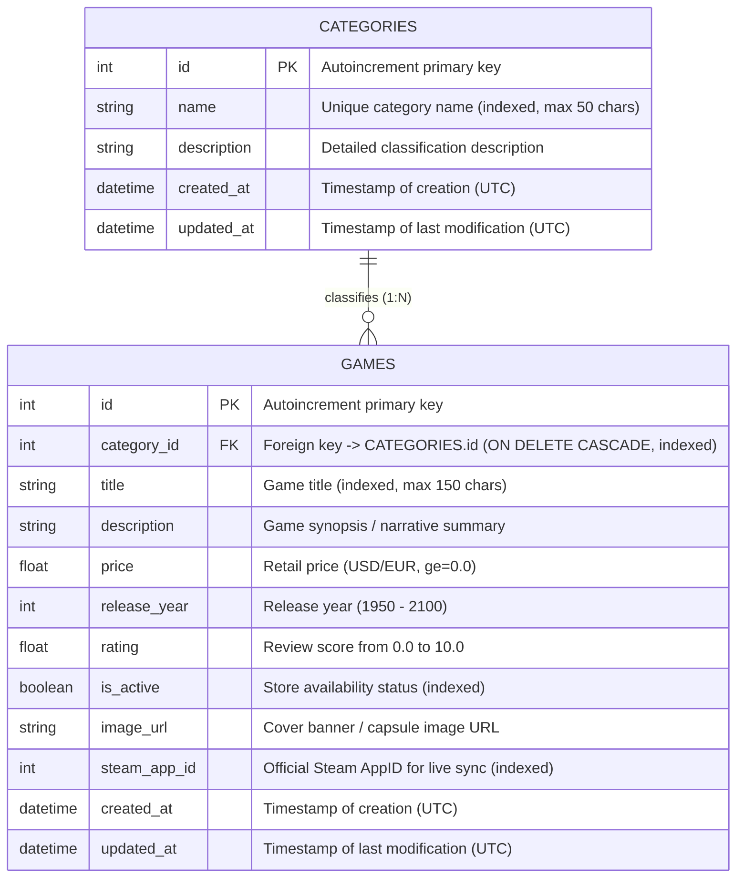

# Database & Entity-Relationship Diagram (ERD)

This document describes the relational database schema, ORM mappings, constraints, and referential integrity mechanisms implemented in **VaporStore**.

---

## Entity-Relationship Diagram (ERD)



---

## Table Specifications

### 1. Table `categories`
Stores classification genres for catalog organization:

| Column | Type | Constraints | Description |
| :--- | :--- | :--- | :--- |
| `id` | `INTEGER` | `PRIMARY KEY AUTOINCREMENT` | Unique identifier |
| `name` | `VARCHAR(50)` | `NOT NULL, UNIQUE, INDEXED` | Category name (e.g. Action, RPG) |
| `description` | `VARCHAR(255)` | `NULLABLE` | Detailed description of the category |
| `created_at` | `DATETIME` | `NOT NULL, DEFAULT UTC` | Record creation timestamp |
| `updated_at` | `DATETIME` | `NOT NULL, ON UPDATE UTC` | Last record update timestamp |

### 2. Table `games`
Stores video game catalog items linked to a specific category:

| Column | Type | Constraints | Description |
| :--- | :--- | :--- | :--- |
| `id` | `INTEGER` | `PRIMARY KEY AUTOINCREMENT` | Unique identifier |
| `category_id` | `INTEGER` | `NOT NULL, FK -> categories.id, INDEXED` | Foreign key referencing category |
| `title` | `VARCHAR(150)` | `NOT NULL, INDEXED` | Game title |
| `description` | `TEXT` | `NULLABLE` | Game narrative summary / synopsis |
| `price` | `FLOAT` | `NOT NULL, DEFAULT 0.0` | Retail price in USD |
| `release_year`| `INTEGER` | `NULLABLE` | Release year |
| `rating` | `FLOAT` | `NULLABLE` | Review score (0.0 to 10.0) |
| `is_active` | `BOOLEAN` | `NOT NULL, DEFAULT TRUE, INDEXED` | Catalog availability status |
| `image_url` | `VARCHAR(255)` | `NULLABLE` | URL to box art or capsule cover |
| `steam_app_id`| `INTEGER` | `NULLABLE, INDEXED` | Official Steam Application ID |
| `created_at` | `DATETIME` | `NOT NULL, DEFAULT UTC` | Record creation timestamp |
| `updated_at` | `DATETIME` | `NOT NULL, ON UPDATE UTC` | Last record update timestamp |

---

## Relational Integrity & Cascade Rules

### 1:N Relationship Configuration
In `Category`:
```python
games: Mapped[list["Game"]] = relationship(
    "Game",
    back_populates="category",
    cascade="all, delete-orphan",
    passive_deletes=True
)
```

In `Game`:
```python
category_id: Mapped[int] = mapped_column(
    ForeignKey("categories.id", ondelete="CASCADE"),
    nullable=False,
    index=True
)
category: Mapped["Category"] = relationship(
    "Category",
    back_populates="games"
)
```

### Cascade Deletion Guarantees
- When a `Category` is deleted via `DELETE /api/v1/categories/{id}`, all associated `Game` records belonging to that category are automatically removed by the database engine.
- This behavior is tested in `backend/tests/test_games.py::test_cascade_delete_category_removes_games` and confirmed in the frontend client with an explicit cascade warning prompt.

### Performance Optimization & Eager Loading
To eliminate the classic **N+1 query problem**, queries in `GameService` employ SQLAlchemy's `joinedload`:
```python
query = db.query(Game).options(joinedload(Game.category))
```
This retrieves both the game and its associated category data in a single SQL `LEFT OUTER JOIN` operation.
