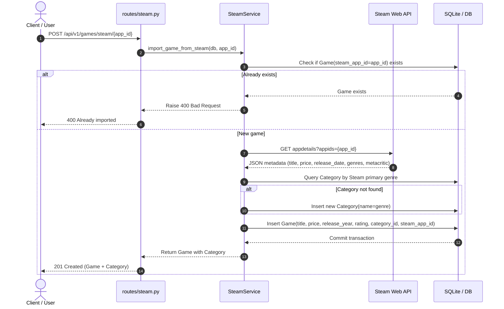

# Steam API Integration ("The Cherry on Top")

This document details the public Steam integration implemented in **VaporStore**, explaining how live store metadata and real-time player statistics enrich the relational catalog without requiring private developer API keys.

---

## Zero-API-Key Architecture

The Steam integration is built exclusively against Valve's official public storefront and community endpoints:

```text
+-----------------------+              +-----------------------------------------+
|   VaporStore Server   | -- HTTP GET -> | store.steampowered.com/api/storesearch | (Catalog search)
|    (SteamService)     | -- HTTP GET -> | store.steampowered.com/api/appdetails  | (Game metadata & genres)
|                       | -- HTTP GET -> | api.steampowered.com/.../GetPlayers    | (Live player counts)
+-----------------------+              +-----------------------------------------+
```

### Advantages
1. **Zero Registration**: Evaluators and developers do not need to register for an API key or set secret tokens.
2. **Deterministic Evaluation**: The system works out-of-the-box in any clean development environment.
3. **Resilience**: External network timeouts (8–10s) and fallback mechanisms ensure that failures in Steam's network never crash the core API.

---

## Endpoints Specification

### 1. `GET /api/v1/steam/search`
Searches public Steam Store titles matching a keyword.

**Query Parameters:**
- `query` (required): Search keyword (minimum 1 character).
- `limit` (optional, default: 10): Maximum items to return.

**Response (200 OK):**
```json
{
  "total": 10,
  "query": "Hades",
  "items": [
    {
      "id": 1145350,
      "name": "Hades II",
      "price": 20.99,
      "image_url": "https://shared.akamai.steamstatic.com/store_item_assets/steam/apps/1145350/capsule_231x87.jpg"
    },
    {
      "id": 1145360,
      "name": "Hades",
      "price": 6.24,
      "image_url": "https://shared.akamai.steamstatic.com/store_item_assets/steam/apps/1145360/capsule_231x87.jpg"
    }
  ]
}
```

---

### 2. `POST /api/v1/games/steam/{app_id}`
**1-Click Relational Import Process**:



**Response (201 Created):**
```json
{
  "id": 2,
  "title": "Hades",
  "description": "Defy the god of the dead as you hack and slash out of the Underworld...",
  "price": 6.24,
  "release_year": 2020,
  "rating": 9.3,
  "is_active": true,
  "steam_app_id": 1145360,
  "category_id": 1,
  "category": {
    "id": 1,
    "name": "Action"
  }
}
```

---

### 3. `GET /api/v1/games/{id}/steam-stats`
Retrieves the number of currently active players on Steam for a game.

**Response (200 OK):**
```json
{
  "game_id": 2,
  "steam_app_id": 1145360,
  "player_count": 4196,
  "is_online": true,
  "service": "Steam Web API"
}
```
- If the game has no `steam_app_id`, returns `400 Bad Request`.
- If the game ID does not exist, returns `404 Not Found`.
